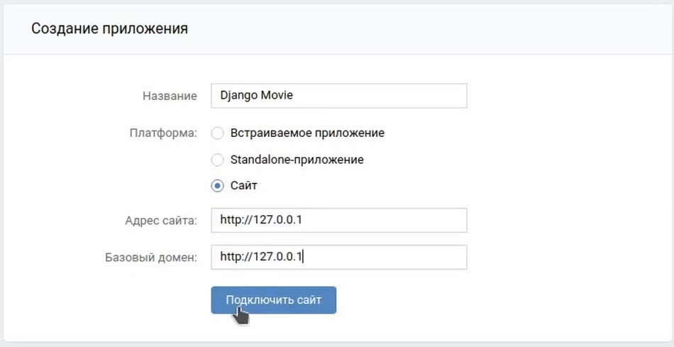
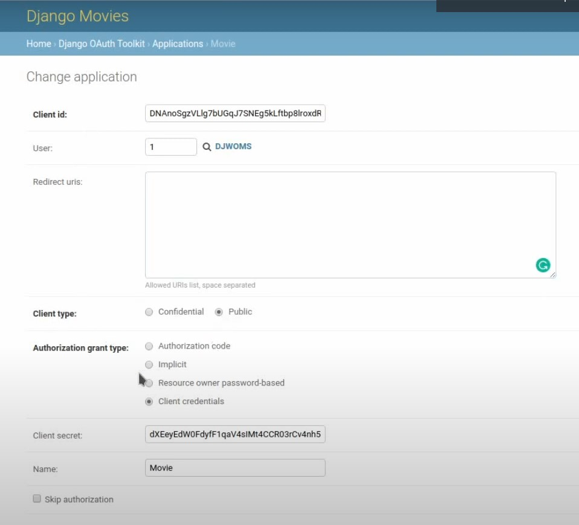
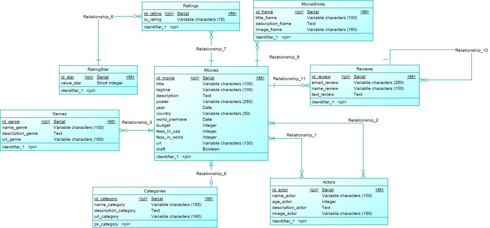

# Фильмы DRF

***

## Описание

Кинобиблиотека на Django Rest Framework.

Приложение докерезировано.

На сайте реализован следующий функционал:
* Пагинация
* Авторизация и регистрация с обычными токенами и JWT
* Отправка email с подтверждением (настройка в разделе _дополнительные возможности_)
* Вход на сайт через VK (настройка в разделе _дополнительные возможности_)
* Автодокументирование api (http://127.0.0.1/swagger)

---

## Окружение проекта:
  * Python 3.8
  * Django 3
  * БД PostgreSQL
  * DRF

---

## Запуск

Склонируйте репозиторий с помощью git

    https://github.com/ChebuRashkaRF/DRF_movie.git

Перейти в папку:
```bash
cd drf_movie
```

В терминале необходимо прописать следующую команду для сбора нового образа и запуска контейнеров:

```bash
docker-compose up --build
```

Чтобы использовать Базу данных с тестовыми данными, необходимо в новом терминале прописать следующую команду

```bash
docker exec -i db_drf psql -U drfuser drfmovie < ./backup_db/drfmovie_backup.dump
```

В этом случае доступен _супер пользователь_:
* Логин: admin111
* Пароль: 1234

---

## Дополнительные возможности

Для того чтобы на сайте работал весь функционал, необходимо выполнить следующие действия.

1. Чтобы работала отправка email с подтверждением, необходимо настроить бесплатный SMTP Сервер от Google, для этого нужно выполнить **Шаг 1** в [инструкции](https://www.hostinger.com.ua/rukovodstva/kak-ispolzovat-smtp-server "бесплатный SMTP Сервер от Google "), а затем в файле _.env.dev_ указать значения переменным: EMAIL_HOST, EMAIL_HOST_USER, EMAIL_HOST_PASSWORD, SEND_ACTIVATION_EMAIL=1

2. Чтобы работал вход на сайт через VK, необходимо создать приложение на сайте _https://vk.com/dev_. Прописать настройки как на изображении: . Затем в файле _.env.dev_ указать значения переменным: SOCIAL_AUTH_VK_OAUTH2_KEY, SOCIAL_AUTH_VK_OAUTH2_SECRET. Далее зайти на сайт администратора (http://127.0.0.1/admin) и в _Django OAuth Toolkit_ > _Applications_ нужно добавить запись как на изображении:  
 **_Client id_ и _Client secret_ не изменять, а в качестве _User_ выбирать супер пользователя**

---

## База данных


